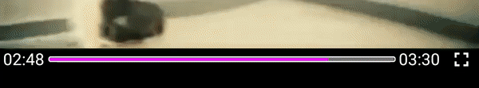

# react-native-reanimated-slider


## motivation
The slider from the react-native is not good for video/audio players. If you slide it while the player is playing the file, It will jump a lot between where the file is playing right now and where your finger is, producing very bad UX. this libray uses `react-native-reanimated` and `react-native-gesture-handler`  to produce 60 fps animations and stops jumping the slider while sliding.


## install
first install and link `react-native-reanimated` and `react-native-gesture-handler` and then install this packeage. they are installed by default in latest react-native.

```
yarn add react-native-reanimated-slider
```
if your are using `react-native-reanimated@1.x.x` install version 1. version 1 is not supported anymore.
## Usage and API reference
[Main Slider](https://github.com/alikazemkhanloo/react-native-reanimated-slider/tree/master/docs/Slider.md)

[Ballon Component](https://github.com/alikazemkhanloo/react-native-reanimated-slider/tree/master/docs/Ballon.md)

##  *Enjoy Sliding* :)
